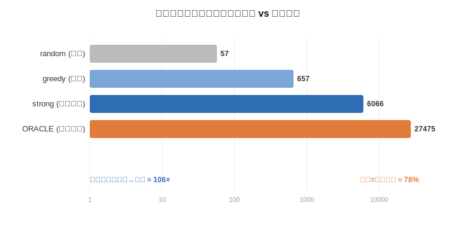
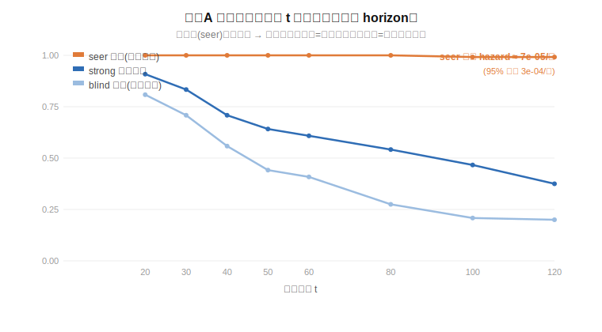
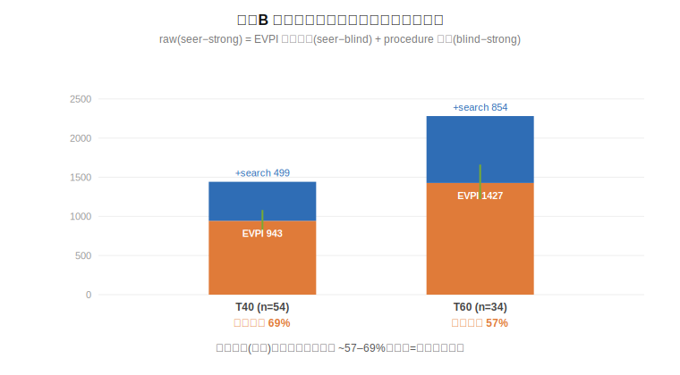
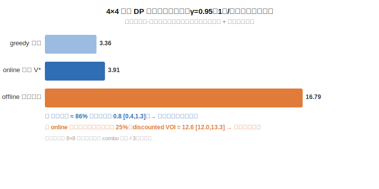

# Luck as the Value of Hindsight
### 用"信息价值"定量分解 Block Blast 类游戏的运气与技能

> **一句话**：在 8×8 Block Blast 这类"单人 + 随机发块 + 生存型"游戏里，我们把**运气**操作化为
> 一个可计算的量——**一个开了"上帝视角"（提前知道未来方块）的玩家，比只能看当前的在线最优玩家
> 多拿的那部分分**。这正是玩家**缺失的信息的价值（value of hindsight）**。再用方差分解、技能阶梯、
> 搜索收敛三条独立证据互相印证，给出"这游戏到底几分靠运气"的量化答案。

---

## 为什么做这个 / 和已有工作的区别

网上关于 Block Blast 的东西几乎全是两类：**(1) 帮你通关的"解题器"网站**；**(2) 训练一个 RL
智能体把游戏玩好**（如 [RisticDjordje/BlockBlast-Game-AI-Agent](https://github.com/RisticDjordje/BlockBlast-Game-AI-Agent)
的 DQN/PPO）。它们都在问"**怎么玩得更好**"。

而 skill-vs-luck 的学术文献（[Skill vs Chance, arXiv:2410.14363](https://arxiv.org/pdf/2410.14363)、
[Geometry of Games, arXiv:2511.11611](https://arxiv.org/pdf/2511.11611)）几乎全是**多人**博弈与评分系统。

**空白点**：没人把 Block Blast 当成"**运气–技能定量分解**"问题来做，更没人对**单人随机生存型游戏**
用**信息价值**去定义运气。本项目就填这个缝。理论锚点来自一句老话——
[*"luck is nothing more than a lack of information"* (Aleph Insights)](https://alephinsights.com/blog/2016/05/skill-and-luck/)——
我们把它**操作化、算出来**。

---

## 游戏与建模

- 8×8 棋盘，无重力；每轮发 **3 个**方块，必须全放完才刷新；填满整行/整列即消除。
- **方块目录 38 种**（含旋转朝向，均匀等概率，见 [`pieces.py`](pieces.py)）。
- **非线性计分**（[`scoring.py`](scoring.py)）：同时消多行按三角数增长、连击(combo)、清盘(all-clear)均有奖励——
  这类奖励专门奖励"跨手布局"，是分析的关键。
- 引擎两版：可读参考实现 [`sim.py`](sim.py)（列表棋盘）+ 高速 [`fast.py`](fast.py)（64-bit bitboard，
  位运算 can_place / 消行 / 启发式）。

四种玩家（技能由低到高）：`random`(乱放) → `greedy`(逐块贪心) → `strong`(手内 beam 搜索，连击贯穿)
→ `lookahead`(beam 候选 + flat Monte-Carlo rollout，λ=1，CRN 配对)。

---

## 方法（三条独立证据 + 一个新指标）

1. **方差分解（ANOVA）**：同一批随机种子喂给不同玩家，把总分方差拆成
   *技能(玩家主效应)* / *运气(种子主效应)* / *交互*。
2. **技能阶梯**：用 ε-greedy 在 random↔strong 间连续插值造出"技能轴"，
   定义**交叉点** = "到天花板的缺口 = 单局运气波动 σ"处的分数——
   **缺口 > σ → 技能主导；缺口 < σ → 运气主导**。回答"多少分以下靠练、以上靠命"。
3. **搜索收敛**：不断加强玩家，看天花板是否停止上移。若 lookahead ≈ strong，说明已近技能上限，
   剩余方差就是不可消除的运气。
4. **【创新指标】信息价值 = 运气**（见 [`oracle_analysis.py`](oracle_analysis.py)）：
   让一个**先知(seer)** 在 rollout 时使用**真实未来方块**，对比一个**结构完全相同、却只能看到未来
   _分布_（采样未来取平均）的 blind 玩家**——两者唯一差别就是"知不知道这一局的真实未来"。其分差
   = **期望完美信息价值 (EVPI)** = 运气的量化。

> ⚠️ **重要修正（2026-05-31，经三轮独立审核）**：早期版本用
> `1 − strong均分/oracle均分 ≈ 78%` 当运气占比。后来发现把 oracle 升级成 beam-rollout + 真未来后，
> 它**近乎不死**——无界对局里能活几万轮、分数滚到 1e5–1e6。于是"分差"被**存活长度**主导、
> **本质无界**，那个 78% 的分母 ill-defined，**已撤回**（见 [`results.json`](results.json) `oracle_RETRACTED`）。
> 正确做法是把运气拆成**两条通道**，且都在**固定 horizon T**（所有玩家只跑 T 轮，分数才可比）下度量：
>
> - **通道 A · 存活运气**：各玩家活过 t 轮的比例。先知几乎不死 → "死"基本可避免=技能；
>   不可约的存活运气 = 罕见的 [Burgiel 杀手序列](https://www.semanticscholar.org/paper/How-to-lose-at-Tetris-Burgiel/11c12871bfa138fa8bb93a4e5dbcca36c5d214fa)，
>   以先知的**每轮死亡 hazard** 给出上界（真最优活得 ≥ 先知）。
> - **通道 B · 计分运气 (EVPI)** = `seer − blind`，**只在"strong/blind/seer 都活到 T"的 cohort 上算**
>   （否则死亡玩家分数被冻结，会把存活差异漏回计分）。再把先知的总优势带符号切分：
>   `raw(seer−strong) = EVPI(信息) + procedure(blind−strong, 搜索本身)`，**不 clip**。
>
> 三轮审核抓出并修正的关键陷阱：① blind 可能 < strong（*rollout 回归*）→ procedure 须带符号、地板用
> strong；② 死亡冻结分污染计分 → cohort 条件化；③ cohort 只留"strong 能活"的易种子 → 算出的
> 运气占比是**下界**（顶部难局的运气计入通道 A）；④ 用"自信猜错"的 anti 会高估信息价值 → headline
> 用 `seer−blind`；⑤ EVPI 两端皆有偏 → 只报 "≈"，靠 **EVPI 随采样数 S、前瞻深度 D 趋平** 背书。

---

## 结论




数据：38 种方块，方差/阶梯 200 种子（[`results.json`](results.json)）；
运气两通道 N=120 种子、D=3、固定 horizon（[`survival.json`](survival.json) / [`channelB.json`](channelB.json)）。

**① 技能地板巨大——这是"技能游戏"的一面。**
乱放均分 **57**，会玩（strong）**6453**，差 **≈113×**。光"不犯傻"就决定了两个数量级。

**② 熟练玩家之间，运气≈技能——这是"运气游戏"的一面。**
方差分解（greedy vs strong）：**技能 34% / 运气 34% / 交互 32%**。
而那 32% 交互项是"**只有会玩的人才兑得出的好牌机会**"，本质偏运气。

**③ 分界不是一刀切，而是在很高处。**
技能阶梯显示：分数 **~3400（交叉点）以下几乎全程技能主导**（缺口/σ 从 139 一路降到 ~6，都 >1），
只有逼近天花板才翻成运气主导。**所以"低分=没练好、不是运气差"对绝大多数水平都成立。**

**④ 运气分两通道（固定 horizon，N=120，D=3，经三轮审核）。**




- **通道 A · 存活运气 ≈ 极小。** 先知活过 t 的比例**全程 ≈ 1.00**（t=120 时 0.99），
  **每轮死亡 hazard 点估计 7×10⁻⁵/轮**（14365 在险轮里仅 1 死；**单侧 95% Poisson 上界 3.3×10⁻⁴/轮 ≈ ≤1 死/3028 轮**——
  1 个事件的采样不确定性大，故报点估计+上界而非把点估计当硬上界）。另有独立的**建模**上界："真最优活得 ≥ seer"，故真实杀手序列率更小。对照在线 strong 从
  0.91(t=20) 一路掉到 0.38(t=120)、blind 更差(0.20)。**含义：有前瞻则游戏几乎不可输 → 普通玩家的"死"
  绝大多数是可避免的技术问题，不是运气；不可约的存活运气只剩罕见的 Burgiel 必死牌。**
- **通道 B · 计分运气 (EVPI) ≈ 先知得分优势的 6 成。** 在"都活到 T"的 cohort 上（份额为 per-seed
  配对中位数 `(seer−blind)/(seer−strong)`，**仅在 seer>strong 的种子上有定义**，附 bootstrap 95% CI）：
  - T=40 (n=54)：`raw 1442 = EVPI 943 [816,1082] + procedure 499`，信息占比 **69% [53,73]**。
  - T=50 (n=41)：`raw 1856 = EVPI 1180 [1020,1356] + procedure 675`，信息占比 **65% [54,71]**。
  - T=60 (n=34)：`raw 2281 = EVPI 1427 [1221,1662] + procedure 854`，信息占比 **57% [54,74]**。
  - 即先知相对最强在线玩家的得分优势里，**~57–69% 是纯粹"知道未来"的价值（运气）**，其余是前瞻搜索
    本身的功劳。该比例随采样数 S∈{4..32} 与前瞻深度 D（D≥3 即饱和）**稳定**。
  - ⚠️ 份额的**分母** `seer−strong` 载重于"strong=真在线天花板"这一假设；若有更强的在线玩家，分母缩小、
    信息占比会**上升**（故现值对 strong 强度而言是**保守下偏**）。这正是方向①（学习型价值函数）要压力测试的假设。

**⑤ 4×4 精确 DP 锚点（可解类比，经三轮审核）。**



8×8 无法精确求解，但 **4×4 可以**——于是拿到 8×8 拿不到的两样东西（`dp4.py`，M=200 序列，γ=0.95）：

- **近视启发式已近在线最优**：贪心达到真·最优(value iteration `V*`)的 **≈86%**（缺口 0.82 [0.37,1.27] 折扣分）
  → 印证"用 beam-strong 当 8×8 在线基线"是合理的。
- **信息价值主导**：即便是**可证明最优**的在线策略，也只兑现"上帝视角(离线 DP)"的 **≈25%**；
  **discounted VOI = 12.6 [12.0,13.3]**（≈在线最优的 3 倍）→ 在一个可精确求解、无 combo 的小棋盘上，
  **"知道未来"仍是压倒性的价值** —— 独立佐证了 8×8 的"信息=运气天花板"主线。

> 这是**类比不是标定**：1 块/回合（非 3 块手牌）、线性计分（无 combo/all-clear）、γ=0.95 折扣。
> 故它**不**复现 8×8 的 57–69%，也**不**建模 combo 运气或 3 块重排技巧——它只独立确认两件事：
> 启发式在线近最优、信息价值巨大。正确性由 `mean(online)=V*(empty)` 硬断言（M=200 通过）保证。

**总结**：Block Blast 是**"技能定地板、运气定天花板"**的游戏，但天花板的"运气"有两副面孔——
**存活几乎全靠技能**（完美前瞻下近乎不死，真运气只剩罕见杀手序列），而**给定存活、想多刷分则约六成靠
牌运**（EVPI 占先知优势 57–69%）。中低水平拼策略（地板 **113×**），顶端在"刷分"维度拼牌运。它与五子棋
（运气=0、有必胜策略）不同范式：这里**无必胜策略**，连无限存活都被
[Burgiel《How to lose at Tetris》](https://www.semanticscholar.org/paper/How-to-lose-at-Tetris-Burgiel/11c12871bfa138fa8bb93a4e5dbcca36c5d214fa)
式杀手序列否定——只是那种序列**极罕见**。

---

## 诚实的局限

- **EVPI 是 "≈" 不是 "="**：seer 只前瞻 D 手（D≥3 已饱和）是真离线最优的**下界**；blind 用 S 份采样
  近似"按分布最优"，仍有蒙特卡洛噪声。两端偏差方向相反，故 EVPI 只报量级 + CI，靠"随 S/D 趋平"背书。
- **cohort 选择偏差 → 计分运气占比是下界**：通道 B 只在"strong 也能活到 T"的种子上算，而这些是**较易的局**；
  顶端难局（strong 早死）的运气被计入**通道 A**。所以"信息占比 57–69%"是计分运气的**保守下界**。
- **存活 hazard 有两层界，须分清**：(1) **采样**不确定性——点估计 7×10⁻⁵/轮 基于 1 死，单侧 95% Poisson 上界 3.3×10⁻⁴/轮；
  (2) **建模**界——真最优活得 ≥ seer，故真实杀手序列率比上面任何一个数都小。两者方向一致（都说"运气导致的死极罕见"），但来源不同。
- **结论依赖计分模型**：line_base/combo/all-clear 数值与**均匀等概率**发牌是建模假设；先知正是靠
  combo 复利刷分，真实游戏若用**自适应 RNG**（按棋盘坑你）会改变比例。计分敏感性分析为后续工作。
- **4×4 DP 是类比非标定**（见 §⑤）：1 块/回合 + 线性计分 + γ 折扣，三处偏离真实 8×8；它独立确认
  "启发式在线近最优"与"信息价值巨大"，但不复现 8×8 的具体百分比，也不建模 combo 运气。
- 真正逼近"在线天花板"需**学习型价值函数（RL/DQN）**；本项目止步于"搜索已收敛 + 信息价值已量化"，未训练 RL。

---

## 复现

零依赖，纯 Python 标准库（含自写 SVG 绘图）。

```bash
python3 pieces.py            # 看 38 种方块目录
python3 sim.py 300           # 方差分解(可读版引擎)
python3 ladder.py 150        # 技能阶梯 + 交叉点
python3 compare.py 20        # 配对收敛(greedy基 vs strong基 rollout)
python3 experiments.py 200 24  # 方差/阶梯/收敛 -> results.json
python3 plots.py             # results.json -> figures/fig1,fig2

# 运气两通道(创新主线, 经三轮审核; D=3 已由 D-sweep 定为 plateau)
python3 oracle_analysis.py sweep 24 80      # D-sweep: 定前瞻深度 D(存活/分数 plateau)
python3 oracle_analysis.py sstab 40 3 40    # EVPI 随采样数 S 是否趋平
python3 oracle_analysis.py survival 120 3   # 通道A 存活曲线 -> survival.json
python3 oracle_analysis.py channel 120 3 40,50,60  # 通道B EVPI 分解(含份额CI) -> channelB.json
python3 dp4.py 200           # 4×4 精确 DP 锚点 -> dp4.json
python3 plots_oracle.py      # survival/channelB/dp4.json -> figures/fig3,fig4,fig5

# 4×4 afterstate-FVI 双 gate 认证（唯一依赖 torch 的文件；分析管线保持零依赖）
python3 -m venv .venv && .venv/bin/pip install torch
.venv/bin/python rl4.py all  # mode-γ + mode-T 训练 + 双 gate -> rl4_gate.json
```

## 方向① 学习型值函数 — 4×4 afterstate-FVI 双 gate 认证（在线天花板的第三个独立估计，第一步）

EVPI 信息占比 57–69% 载重于"strong(beam,无前瞻)=真在线天花板"这一假设。方向① 用一个
**与搜索正交的学习型值函数**独立再测一次。烧 8×8 算力前，先在有精确 DP 真值的 **4×4**
上证明 afterstate 拟合值迭代(FVI) pipeline 可信——否则 8×8 打不过 beam-strong 时分不清
"到天花板了"还是"网没训好"（弱 agent 陷阱）。`rl4.py` 训两个 head（MLP afterstate 值网络）：

| gate | 判据（预注册） | 真值 | 结果 |
|---|---|---|---|
| **γ-gate 值** | \|V_net(empty) − 3.9157\| < 0.05 | value_iteration(γ=0.95)=3.9157 | **PASS** Δ=0.0013 |
| **γ-gate 策略** | greedy-on-V_net 最优比 paired-CRN bootstrap 95% CI 下界 ≥ 0.92 | 近视贪心 0.859 | **PASS** ratio 1.005, CI[0.997,1.013] |
| **T-gate 值** | T∈{8,16} \|V_net(empty,T) − bdp_T(T)\|/bdp_T(T) < 5% | bdp_T(8)=3.5934, (16)=4.8637 | **PASS** 2.2% / 3.9% |
| **T-gate 在线** | M=50k 无折扣 T-rollout 相对偏差 < 5% + 精度护栏 2·SE < 2.5%·bdp_T | bdp_T(T) | **PASS** 1.6% / 1.5%, 护栏过 |
| **位移检查** | 探针集 V 变化 > τ_disp（V-单位, binding）；corr(V_net,heuristic4)<0.92（advisory） | corr(heuristic4,V\*)=0.870 | **PASS** disp 0.74>0.22; corr 0.871 |

**双 gate 皆 PASS ⇒ 认证 4×4 afterstate-FVI pipeline**（值网络 + FVI 循环 + γ/无折扣-T 两种
backup + 真值复现 + 位移检查）。结果见 `rl4_gate.json`。

**不认证项（务必声明）**：4×4 是**单块/回合 + 线性计分（无 combo）**。双 gate **不**认证 8×8 的
beam_hand 三块手牌候选枚举 × afterstate 集成 —— 那层靠将来的 8×8 competence gate（vs beam-strong
paired-CRN + 预注册效应量）兜底。本认证只说"FVI 机器在可精确求解的小盘上能复现真·最优 + 真·有限-T 值"。

工程要点：mode-γ 用 hidden=256（紧的 0.05 绝对值 gate 需压住 max-算子的高估偏置——小网会高估
~4%）；mode-T 用 hidden=128（5% 相对 gate 较松，且每 sweep 快 ~2.5×，102 sweep / 637s 收敛）。

## 文件

| 文件 | 作用 |
|---|---|
| `pieces.py` | 38 种方块目录（旋转生成+去重） |
| `scoring.py` | 非线性计分模型（multi-clear/combo/all-clear，可调） |
| `sim.py` | 可读参考引擎 + 方差分解 |
| `fast.py` | bitboard 高速引擎 + beam-strong + lookahead + beam rollout |
| `ladder.py` | 技能阶梯 + 交叉点 |
| `compare.py` | 配对头对头（CRN，验证 rollout 回归） |
| `experiments.py` | 方差/阶梯/收敛 -> `results.json` |
| **`oracle_analysis.py`** | **运气两通道（创新主线）：seer/blind/anti 玩家 + 固定 horizon + 存活曲线 + EVPI 分解 + bootstrap CI** |
| **`dp4.py`** | **4×4 精确 DP 锚点：value iteration 真·最优 + 离线 DP + 贪心，discounted VOI + 启发式缺口 + backward_dp_T 无折扣有限-T 真值** |
| **`rl4.py`** | **方向① 4×4 afterstate-FVI 双 gate 认证（torch）：mode-γ/mode-T 值网络 + FVI + 无折扣 T-rollout + 位移检查 -> `rl4_gate.json`** |
| `plots.py` | 零依赖 SVG（fig1 玩家 / fig2 阶梯） |
| `plots_oracle.py` | 零依赖 SVG（fig3 存活 / fig4 EVPI / fig5 4×4 锚点） |

## License
MIT
